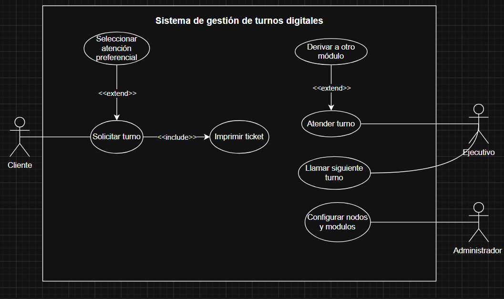
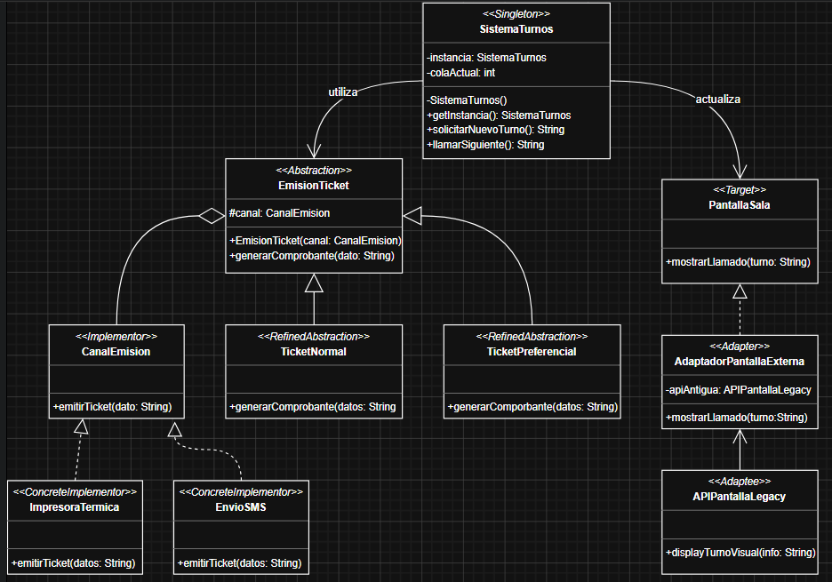
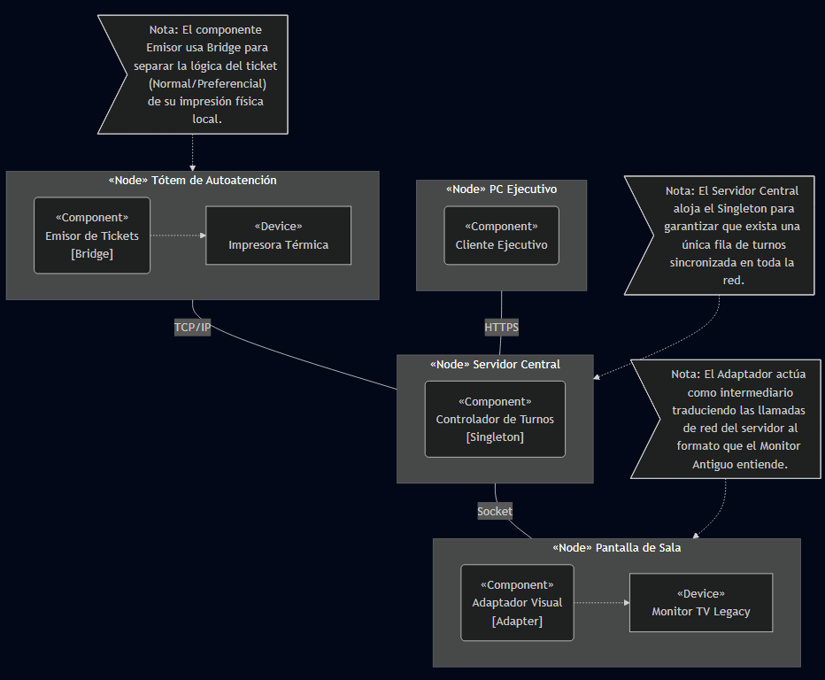

# Sistema de Gestión de Turnos Digitales (Tunomático)

## Descripción General
El proyecto documenta el modelado arquitectónico completo del sistema "Tunomático", una plataforma distribuida diseñada para la gestión eficiente de filas y atención al público. La arquitectura propuesta abarca desde la captura de requerimientos funcionales hasta el despliegue físico, garantizando escalabilidad, bajo acoplamiento y alta cohesión mediante la aplicación de patrones de diseño GoF (Gang of Four).

---

## 1. Visión Funcional: Diagrama de Casos de Uso

### Descripción y Justificación de Relaciones
El modelo funcional define las interacciones entre los actores principales (Cliente) y los actores de soporte (Ejecutivo, Administrador) con los límites del sistema. Se han aplicado relaciones estructuradas para modularizar el comportamiento:
* **Relación `<<include>>` (Obligatoria):** Aplicada desde `Solicitar turno` hacia `Imprimir ticket`. Se justifica porque la emisión de un comprobante físico o digital es una precondición ineludible y parte del flujo base tras la generación de un turno en el sistema.
* **Relaciones `<<extend>>` (Opcionales):** * Desde `Seleccionar atención preferencial` hacia `Solicitar turno`: El flujo normal asume un turno estándar. La selección de preferencia es un comportamiento alternativo que extiende el caso de uso base solo bajo ciertas condiciones del cliente.
  * Desde `Derivar a otro módulo` hacia `Atender turno`: Representa un flujo alternativo donde el ejecutivo, dependiendo de la complejidad del trámite, decide extender la atención derivando al cliente en lugar de finalizar el proceso.

---

## 2. Diseño Lógico: Diagrama de Clases

### Justificación de Patrones de Diseño Aplicados
Para asegurar un diseño robusto y mantenible, la arquitectura lógica integra los siguientes patrones estructurales y creacionales:

1. **Singleton (Creacional):** Implementado en la clase `SistemaTurnos`.
   * **Justificación:** Es crítico que el sistema mantenga un único punto de verdad para la cola actual de turnos. Instancias múltiples provocarían colisiones de datos y asignación de turnos duplicados. El Singleton garantiza acceso global y sincronizado a la fila.
2. **Bridge (Estructural):** Implementado entre `EmisionTicket` (Abstracción) y `CanalEmision` (Implementador).
   * **Justificación:** Previene la explosión de clases al separar *qué* se emite (Ticket normal o preferencial) de *cómo* se emite (Impresora térmica o SMS). Esto permite agregar nuevos canales (ej. WhatsApp) o nuevos tipos de ticket sin modificar el código base.
3. **Adapter (Estructural):** Implementado en `AdaptadorPantallaExterna`.
   * **Justificación:** El sistema moderno necesita comunicarse con hardware legacy (`Monitor TV Legacy`). El adaptador envuelve la API antigua (`APIPantallaLegacy`) y la expone bajo la interfaz moderna (`PantallaSala`), permitiendo la integración sin alterar el código del controlador principal.

---

## 3. Arquitectura Física: Diagrama de Implementación

### Decisiones técnicas y despliegue
El diagrama ilustra una topología distribuida que refleja los patrones aplicados en la infraestructura real:
* **Desacoplamiento de Nodos:** Se separó la lógica de negocio (`Servidor central`) de los puntos de interacción (`Tótem` y `PC Ejecutivo`). El Servidor Central aloja el componente Singleton, centralizando la lógica de enrutamiento a través de protocolos seguros (HTTPS para la intranet ejecutiva, TCP/IP interno para el tótem).
* **Integración de Hardware:** El patrón Bridge se materializa en el Tótem, donde el componente de software interactúa dinámicamente con el dispositivo `Impresora térmica`.
* **Soporte Legacy mediante Adapter:** Se estableció una conexión directa por Socket desde el servidor hacia la `Pantalla de sala`, donde el componente Adapter traduce los paquetes de red al formato propietario del dispositivo antiguo.

---

## 4. Reflexiones Finales
El proceso de modelado iterativo demuestra que el diseño de software trasciende la simple codificación. La transición de los Casos de Uso a las Clases permitió identificar cuellos de botella lógicos, los cuales fueron mitigados proactivamente mediante patrones de diseño. Finalmente, el Diagrama de Implementación validó que nuestra abstracción de software es viable y desplegable en un entorno de red físico real, cumpliendo con los estándares de interoperabilidad y escalabilidad exigidos en la gestión de alta concurrencia.
